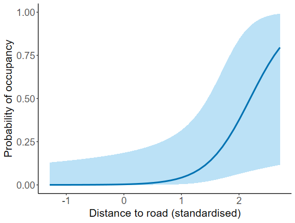
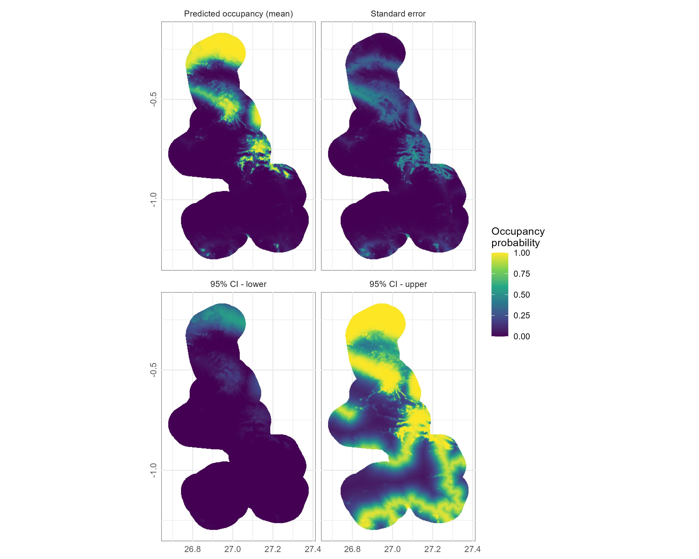
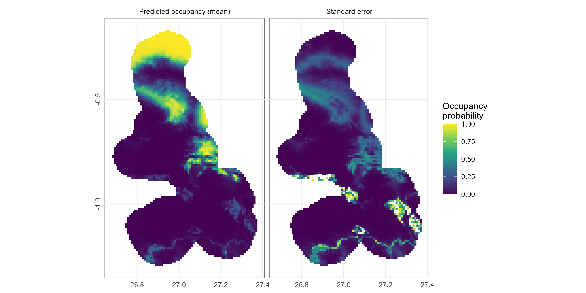
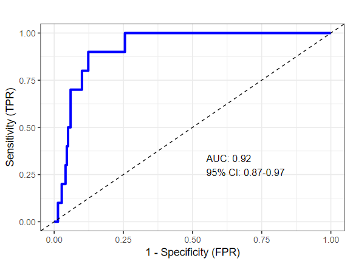

<!-- README.md is generated from README.Rmd. Please edit that file -->

# plotunmarked

<!-- badges: start -->

<!-- badges: end -->

The goal of **plotunmarked** is to provide convenient plotting functions
for visualising predictions from unmarked models, particularly occupancy
estimates - a quick and dirty approach!

## Installation

You can install the development version of plotunmarked from
[GitHub](https://github.com/) with:

``` r
# install.packages("pak")
pak::pak("ugyenpenjor1/plotunmarked")
# OR using devtools:
devtools::install_github("ugyenpenjor1/plotunmarked")
```

## Example

This is a basic example which shows you how to use the functions of the package.

### Plot occupancy vs covariate

Below is an example of how to plot occupancy against a covariate using the `plot_occupancy()` function

```r
library(plotunmarked)
if (requireNamespace("unmarked", quietly = TRUE)) {
  # Plot occupancy vs covariate 
  plot_occupancy(
    model,
    "droa", # change this to plot for other variables
    xlab = "Distance to road (standardised)"
  )
}
```


A similar plot can be made for model-averaged coefficient using the `plot_modavg_response()` function.

```r
plot_modavg_response(
  model_selection_table = ms,   # model selection table
  model_list = mod_ls_2,        # list of models within some delta AIC threshold (delta AIC < 2)
  covariate = "droa",           # covariate name as it appears in your model
  fixed_vals = list(driv = 0, elev = 0, tree = 0), # other covariate values fixed to 0 if standardised
  response_type = "state",      # occupancy; "det" for detection probability
  xlab = "Distance to road"     # intuitive label
)
```

### Plot predicted occupancy map from a single model (this can be your top model or best model)

```r
library(terra)
riv <- rast("C/yourdirectory/dist_river.tif")

# Or
library(raster)
riv <- raster("C/yourdirectory/dist_river.tif")
```

#### Standardise raster using mean and SD of covariates

Use `standardise_raster()` function to standardise raster.

```r
driv <- standardise_raster(
  raster_layer = riv,    # raster layer
  cov_data = cov,        # covariate data frame
  cov_name = "DRiver"    # covariate name in cov 
)
```
Likewise, for other raster layers...

Create a raster list and make a map

```r
# Create a raster list
raster_list <- list(driv = driv, droa = droa, elev = ele)

# Make a map
psi_map <- occupancy_map(
  model = model,                       # top or best model
  covariate_rasters = raster_list,     # standardised raster list
  return_class = "terra",              # if input was loaded using the raster package, choose "raster"
  plot_map = TRUE,                     # display map
  plot_ci = TRUE,                      # plot lower and upper prediction maps
  ci_level = 0.95,                     # confidence threshold
  save_plot = TRUE,                    # saves the plot in your working directory
  plot_filename = "occupancy_map_top"  # if save_plot = TRUE
)
```


### Plot predicted occupancy map using model-averaged coefficients

```r
# Create model list (models within some delta AIC threshold)
mod_list <- list("occ.1" = model1, "occ.2" = model2)

# Create raster stack
raster_stk <- stack(driv_s, droa_s, ele_s, tree_s)         # using raster package
#raster_stk <- c(driv_s, droa_s, ele_s, tree_s)            # using terra package
names(raster_stk) <- c("driv", "droa", "elev", "tree")     # rename to match covariates names in models

psi_map_ma <- modavg_occupancy_map(
  d2_mod_list = mod_list,                  # model list
  pred_cov_stack = raster_stk,             # stacked rasters
  agg_factor = 4,                          # raster resolution, higher number produces coarser map but runs quicker
  plot_ci = TRUE,                          # plot lower and upper prediction maps
  save_plot = TRUE,                        # saves the plot
  plot_filename = "plot_name",             # plot name
  plot_format = "png"                      # plot format (also avaiable as "jpeg" and "tif"
)
```


### ROC curve and AUC to validate prediction

```r
# AUC and ROC for a single model
auc_plot(model, use_detection = FALSE)   

# Model-averaged AUC and ROC
auc_modavg_plot(
  model_list = list(model1, model2),  # list of models
  use_detection = TRUE,               # whether raw detection to use
  detection_history = detn            # if use_detection = TRUE, supply detection matrix
) 
```



This work is in progress. If you have any questions or discover bugs, please report to ugyenpenjor.bt@gmail.com. 
